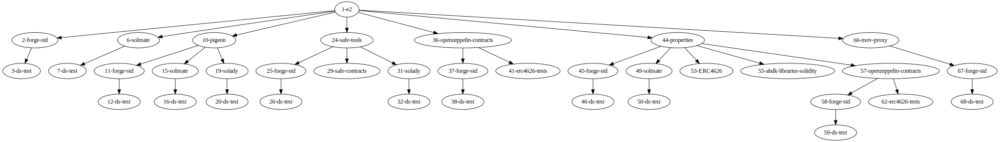

# `viz-submodules`

Generate dependency graph (a naive one) in DOT notation. 

> Inspired by https://github.com/jrfonseca/xdot.py but without the GUI

## Setup

```bash
pyenv shell 3.10
```

```bash
poetry install
```

## Usage

>**Note**    
> XDOT is the IR that Graphviz uses (via pydot) - it is probably more usable for other use cases besides generating images (which DOT is intended for)

[Example of XDOT in Graphviz playground](https://dreampuf.github.io/GraphvizOnline/#digraph%20G%20%7B%0A%221-e2%22%3B%0A%221-e2%22%20-%3E%20%222-forge-std%22%3B%0A%222-forge-std%22%3B%0A%222-forge-std%22%20-%3E%20%223-ds-test%22%3B%0A%223-ds-test%22%3B%0A%221-e2%22%20-%3E%20%226-solmate%22%3B%0A%226-solmate%22%3B%0A%226-solmate%22%20-%3E%20%227-ds-test%22%3B%0A%227-ds-test%22%3B%0A%221-e2%22%20-%3E%20%2210-pigeon%22%3B%0A%2210-pigeon%22%3B%0A%2210-pigeon%22%20-%3E%20%2211-forge-std%22%3B%0A%2211-forge-std%22%3B%0A%2211-forge-std%22%20-%3E%20%2212-ds-test%22%3B%0A%2212-ds-test%22%3B%0A%2210-pigeon%22%20-%3E%20%2215-solmate%22%3B%0A%2215-solmate%22%3B%0A%2215-solmate%22%20-%3E%20%2216-ds-test%22%3B%0A%2216-ds-test%22%3B%0A%2210-pigeon%22%20-%3E%20%2219-solady%22%3B%0A%2219-solady%22%3B%0A%2219-solady%22%20-%3E%20%2220-ds-test%22%3B%0A%2220-ds-test%22%3B%0A%221-e2%22%20-%3E%20%2224-safe-tools%22%3B%0A%2224-safe-tools%22%3B%0A%2224-safe-tools%22%20-%3E%20%2225-forge-std%22%3B%0A%2225-forge-std%22%3B%0A%2225-forge-std%22%20-%3E%20%2226-ds-test%22%3B%0A%2226-ds-test%22%3B%0A%2224-safe-tools%22%20-%3E%20%2229-safe-contracts%22%3B%0A%2229-safe-contracts%22%3B%0A%2224-safe-tools%22%20-%3E%20%2231-solady%22%3B%0A%2231-solady%22%3B%0A%2231-solady%22%20-%3E%20%2232-ds-test%22%3B%0A%2232-ds-test%22%3B%0A%221-e2%22%20-%3E%20%2236-openzeppelin-contracts%22%3B%0A%2236-openzeppelin-contracts%22%3B%0A%2236-openzeppelin-contracts%22%20-%3E%20%2237-forge-std%22%3B%0A%2237-forge-std%22%3B%0A%2237-forge-std%22%20-%3E%20%2238-ds-test%22%3B%0A%2238-ds-test%22%3B%0A%2236-openzeppelin-contracts%22%20-%3E%20%2241-erc4626-tests%22%3B%0A%2241-erc4626-tests%22%3B%0A%221-e2%22%20-%3E%20%2244-properties%22%3B%0A%2244-properties%22%3B%0A%2244-properties%22%20-%3E%20%2245-forge-std%22%3B%0A%2245-forge-std%22%3B%0A%2245-forge-std%22%20-%3E%20%2246-ds-test%22%3B%0A%2246-ds-test%22%3B%0A%2244-properties%22%20-%3E%20%2249-solmate%22%3B%0A%2249-solmate%22%3B%0A%2249-solmate%22%20-%3E%20%2250-ds-test%22%3B%0A%2250-ds-test%22%3B%0A%2244-properties%22%20-%3E%20%2253-ERC4626%22%3B%0A%2253-ERC4626%22%3B%0A%2244-properties%22%20-%3E%20%2255-abdk-libraries-solidity%22%3B%0A%2255-abdk-libraries-solidity%22%3B%0A%2244-properties%22%20-%3E%20%2257-openzeppelin-contracts%22%3B%0A%2257-openzeppelin-contracts%22%3B%0A%2257-openzeppelin-contracts%22%20-%3E%20%2258-forge-std%22%3B%0A%2258-forge-std%22%3B%0A%2258-forge-std%22%20-%3E%20%2259-ds-test%22%3B%0A%2259-ds-test%22%3B%0A%2257-openzeppelin-contracts%22%20-%3E%20%2262-erc4626-tests%22%3B%0A%2262-erc4626-tests%22%3B%0A%221-e2%22%20-%3E%20%2266-mev-proxy%22%3B%0A%2266-mev-proxy%22%3B%0A%2266-mev-proxy%22%20-%3E%20%2267-forge-std%22%3B%0A%2267-forge-std%22%3B%0A%2267-forge-std%22%20-%3E%20%2268-ds-test%22%3B%0A%2268-ds-test%22%3B%0A%7D%0A)

### Generate DOT Graph

```bash
python3 main.py $HOME/mevETH2 -m dot
```




### Generate 'Tree' ASCII

```bash
$ python3 main.py $HOME/e2 -m text
```
```
mevETH2
--- forge-std
------ ds-test
--- solmate
------ ds-test
--- pigeon
------ forge-std
--------- ds-test
------ solmate
--------- ds-test
------ solady
--------- ds-test
--- safe-tools
------ forge-std
--------- ds-test
------ safe-contracts
------ solady
--------- ds-test
--- openzeppelin-contracts
------ forge-std
--------- ds-test
------ erc4626-tests
--- properties
------ forge-std
--------- ds-test
------ solmate
--------- ds-test
------ ERC4626
------ abdk-libraries-solidity
------ openzeppelin-contracts
--------- forge-std
------------ ds-test
--------- erc4626-tests
--- mev-proxy
------ forge-std
--------- ds-test
```
## License

UPL-1.0
